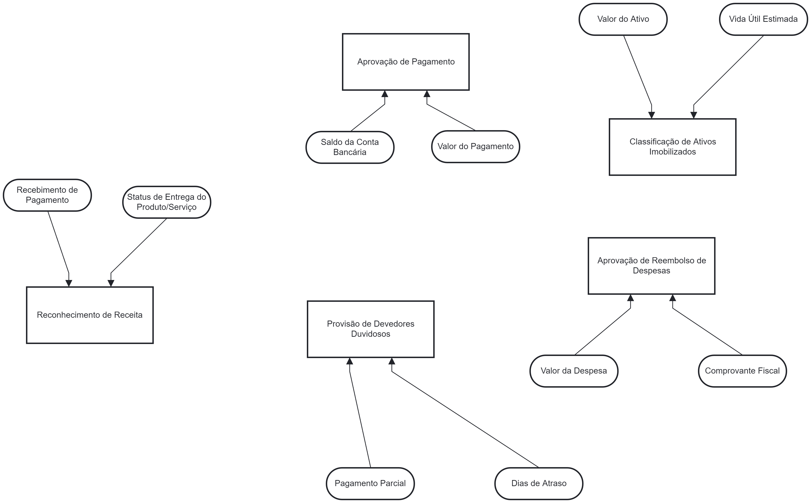

# Documentação das Regras de Decisão na Área de Contabilidade

## Introdução

Este documento fornece uma descrição detalhada das regras de decisão estabelecidas para o processo de contabilidade. As regras são elaboradas para assegurar que as operações contábeis sejam realizadas de forma consistente e em conformidade com as políticas da empresa. Cada regra de decisão é descrita em termos de sua finalidade, critérios de aplicação, ação esperada e responsável.

## Tabela Resumo das Regras de Decisão

| Nº  | Regra de Decisão                              | Descrição Resumida                                                                                         | Responsável                   |
| --- | --------------------------------------------- | ---------------------------------------------------------------------------------------------------------- | ----------------------------- |
| 1   | Aprovação de Pagamento                        | Aprovação de pagamentos inferiores a R$10.000 com saldo suficiente na conta.                               | Departamento de Contas a Pagar |
| 2   | Reconhecimento de Receita                     | Reconhecimento de receita na entrega do produto/serviço com fatura emitida e pagamento recebido.            | Departamento de Contabilidade  |
| 3   | Provisão de Devedores Duvidosos               | Provisão para contas a receber com mais de 90 dias de atraso sem pagamento parcial.                         | Departamento de Contabilidade  |
| 4   | Aprovação de Reembolso de Despesas            | Aprovação de reembolso de despesas inferiores a R$2.000 com comprovante fiscal válido.                      | Departamento Financeiro        |
| 5   | Classificação de Ativos Imobilizados          | Classificação de ativos como imobilizados se valor superior a R$5.000 e vida útil estimada maior que 12 meses. | Departamento de Contabilidade  |

## Documentação das Regras

### 1. Regra de Decisão de Aprovação de Pagamento

- **Objetivo:** Garantir que todos os pagamentos realizados estejam dentro dos limites financeiros estabelecidos e que a conta designada tenha fundos suficientes para cobrir a transação.
- **Critérios de Aplicação:** A regra é aplicada a todas as solicitações de pagamento que sejam inferiores a R$10.000.
- **Ação:** Aprovar automaticamente o pagamento se os critérios forem atendidos, assegurando a eficiência no processamento de transações financeiras.
- **Responsável:** O Departamento de Contas a Pagar é responsável por verificar e aprovar os pagamentos com base nesta regra.

### 2. Regra de Decisão de Reconhecimento de Receita

- **Objetivo:** Garantir que a receita seja reconhecida de acordo com o princípio da realização, apenas quando o produto ou serviço for entregue ao cliente e o pagamento tenha sido confirmado.
- **Critérios de Aplicação:** Aplicável a todas as vendas de produtos ou prestação de serviços, onde a entrega foi confirmada e o pagamento foi recebido.
- **Ação:** Registrar a receita na contabilidade assim que os critérios forem cumpridos, garantindo que as demonstrações financeiras reflitam com precisão as receitas da empresa.
- **Responsável:** O Departamento de Contabilidade é responsável por registrar a receita conforme descrito nesta regra.

### 3. Regra de Decisão para Provisão de Devedores Duvidosos

- **Objetivo:** Minimizar o impacto financeiro de contas a receber que estão atrasadas há mais de 90 dias, através da provisão de devedores duvidosos.
- **Critérios de Aplicação:** A regra se aplica a todas as contas a receber com mais de 90 dias de atraso e sem qualquer pagamento parcial registrado.
- **Ação:** Realizar uma provisão de 50% do valor devido para cobrir potenciais perdas, protegendo a empresa contra inadimplência.
- **Responsável:** O Departamento de Contabilidade é encarregado de registrar a provisão de devedores duvidosos conforme esta regra.

### 4. Regra de Decisão para Aprovação de Reembolso de Despesas

- **Objetivo:** Assegurar que todos os reembolsos de despesas estejam dentro dos limites estabelecidos e devidamente documentados com comprovantes fiscais.
- **Critérios de Aplicação:** Aplicável a todas as solicitações de reembolso de despesas inferiores a R$2.000 que estejam acompanhadas de comprovantes fiscais válidos.
- **Ação:** Aprovar e processar o pagamento do reembolso se os critérios forem atendidos, agilizando o reembolso de despesas dos funcionários.
- **Responsável:** O Departamento Financeiro é responsável por verificar e aprovar os pedidos de reembolso com base nesta regra.

### 5. Regra de Decisão para Classificação de Ativos Imobilizados

- **Objetivo:** Garantir que os ativos adquiridos pela empresa sejam classificados corretamente como imobilizados, de acordo com o valor e a vida útil esperada.
- **Critérios de Aplicação:** Aplicável a todos os ativos adquiridos com valor superior a R$5.000 e com uma vida útil estimada maior que 12 meses.
- **Ação:** Registrar o ativo como imobilizado na contabilidade da empresa, garantindo que a depreciação seja contabilizada adequadamente.
- **Responsável:** O Departamento de Contabilidade é encarregado de classificar e registrar os ativos imobilizados conforme esta regra.

## Modelo DMN

Figura X - Título

Fonte: Material produzido pelos autores (2024)

## Conclusão

As regras de decisão descritas neste documento foram elaboradas para assegurar a integridade e precisão dos processos contábeis na empresa, minimizando riscos e garantindo conformidade com as melhores práticas. A implementação destas regras proporcionará maior eficiência e transparência nas operações contábeis.

## Finalização

Este documento reflete o alinhamento das práticas de decisão contábil com os objetivos estratégicos da empresa, garantindo que cada decisão seja tomada com base em critérios claros e consistentes. A seguir, será adicionado o modelo DMN correspondente, que complementará as regras aqui apresentadas.
